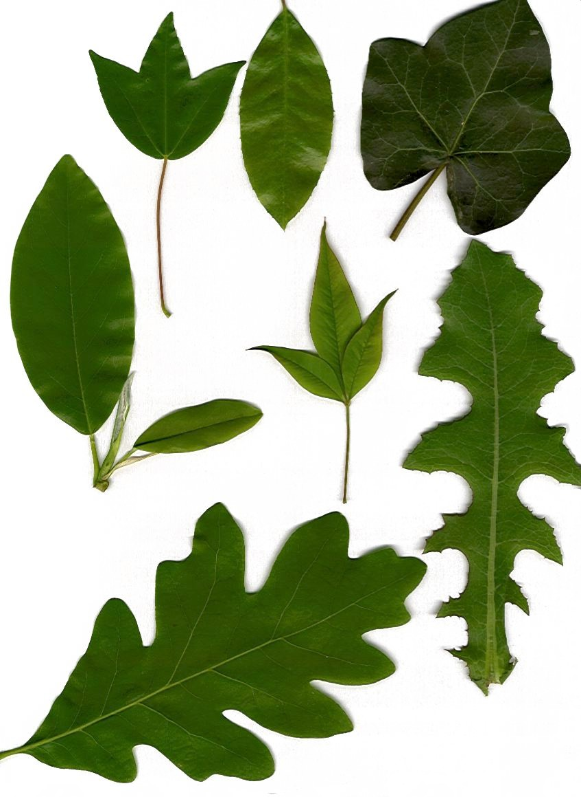
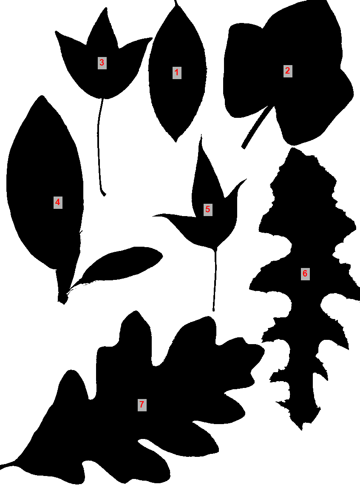

# PixelCounter

| Eredeti scan | Feldolgozott (F&F) |
|:---:|:---:|
|  |  |

Windows-os asztali alkalmazás beolvasott képeken lévő objektumok területének mérésére, fekete és fehér pixelek arányának elemzésével. Eredetileg levélfelület mérésére tervezték lapolvasóval készített felvételekhez.

## Hogyan működik

1. Helyezd az objektumot (pl. levelet) fehér háttérre, majd scanneld be.
2. A PixelCounter [Otsu-küszöbözéssel](https://en.wikipedia.org/wiki/Otsu%27s_method) fekete-fehérré alakítja a képet.
3. Megszámolja a fekete pixeleket, és a területet vagy a kép metaadatából kiolvasott DPI-ból, vagy kézzel megadott papírméretből számítja.

```
Terület (cm²) = fekete pixelek × (2,54 / dpiX) × (2,54 / dpiY)
```

Ha a beolvasott kép tartalmaz DPI metaadatot (amit minden elterjedt lapolvasó beír), nincs szükség manuális skálázásra.

## Funkciók

- **Automatikus DPI kalibráció** — a területet közvetlenül a kép metaadatából kiolvasott felbontásból számítja; ha a metaadat hiányzik, automatikusan papírméret módba vált.
- **Kötegelt feldolgozás** — egy kiválasztott mappa összes képét egyszerre dolgozza fel, és egyetlen TSV riportot ír.
- **Otsu-küszöbözés** — automatikus fekete-fehér konverzió, manuális küszöbbeállítás nélkül.
- **Lyukkitöltés** — flood-fill algoritmus bezárja a belső fehér területeket (pl. levélerezet) a mérés előtt, így csak a külső kontúr határozza meg a területet.
- **Összefüggő komponensek elemzése** — egy képen belül több különálló objektumot is felismer és mér; minden objektum külön sorba kerül a riportban.
- **Feliratozott kimenet** — fekete-fehér PNG-t ment, amelyen minden objektum súlypontjára ráírja a sorszámot, így az eredmények visszavezethetők az egyes objektumokhoz.
- **Papírméret fallback** — A0–A4 presetek vagy egyedi szélesség × magasság mm-ben, ha a DPI metaadat nem elérhető.
- **Kétnyelvű felület** — alapértelmezetten angol; `hu-HU` rendszerkörnyezetben automatikusan magyarra vált.

## Riport formátuma

Az eredmények `report.txt` fájlba kerülnek (tabulátorral elválasztva) a forrás mappában.

### Normál mód

| Fájlnév | Fekete Px (db) | Fehér Px (db) | Egyéb Px (db) | Arány (%) | Terület (cm²) |
|---------|----------------|---------------|---------------|-----------|---------------|

### Komponens mód

| Fájlnév | Komponens # | Fekete Px (db) | Terület (cm²) |
|---------|-------------|----------------|---------------|

## Felhasználói felület

| Vezérlő | Leírás |
|---------|--------|
| **Automatikus (DPI metaadat)** | DPI kiolvasása a kép metaadatából (ajánlott scannerrel készített képekhez) |
| **Papír mérete** | Fallback: A0–A4 preset vagy egyedi méretek mm-ben |
| **Fekete/Fehér** | Otsu-küszöbözés alkalmazása számlálás előtt |
| **Lyukkitöltés** | Belső fehér területek (erezet, lyukak) bezárása mérés előtt |
| **Komponensek** | Minden objektum külön mérése |
| **Min. méret (px)** | Ennél kisebb foltok zajként figyelmen kívül hagyva |
| **PNG** | A feldolgozott fekete-fehér kép mentése (komponens módban sorszámokkal) |

## Rendszerkövetelmények

- Windows 10 / 11
- [.NET 8 Desktop Runtime](https://dotnet.microsoft.com/download/dotnet/8.0)

## Fordítás forrásból

```bash
git clone https://github.com/your-username/PixelCounter.git
cd PixelCounter
dotnet build PixelCounter/PixelCounter.csproj
```

## Támogatott képformátumok

`.bmp` `.png` `.jpg` `.gif` `.tiff` `.tif`

## Licenc

MIT
